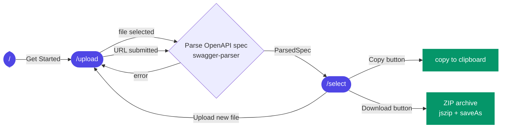
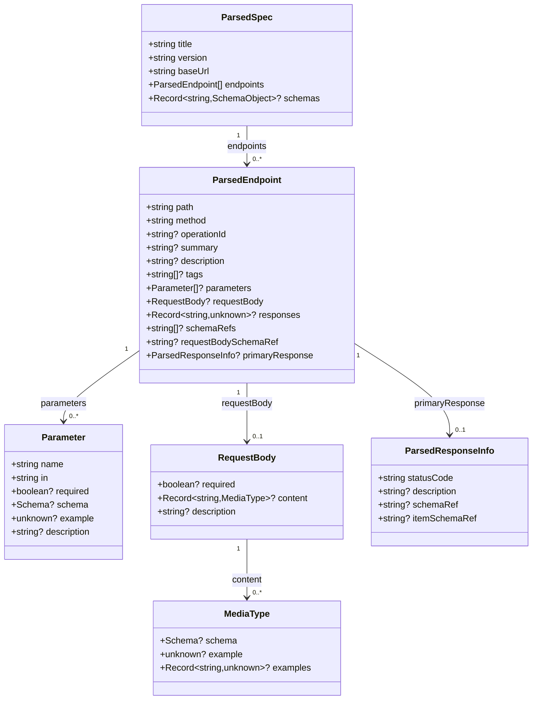
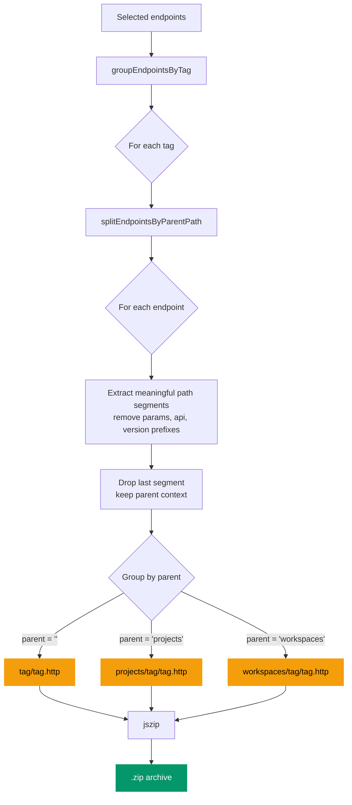

# Architecture

This document describes the high-level architecture of **http-file-generator**, explains the directory layout, and traces the data flow from file upload to `.http` file download.

---

## Technology Overview

| Concern           | Choice                                 | Notes                                                                                    |
| ----------------- | -------------------------------------- | ---------------------------------------------------------------------------------------- |
| Framework         | Next.js 14 (App Router)                | Uses React Server Components where possible; client components are marked `"use client"` |
| Language          | TypeScript (strict)                    | All source files are `.ts` / `.tsx`                                                      |
| Styling           | Tailwind CSS v4                        | `cn()` utility from `src/lib/utils.ts` merges class names with `tailwind-merge`          |
| UI primitives     | shadcn/ui                              | Components live in `src/components/ui/`                                                  |
| Icons             | `lucide-react`                         |                                                                                          |
| OpenAPI parsing   | `@apidevtools/swagger-parser` + `yaml` | Runs entirely in the browser; the spec is never sent to a server                         |
| ZIP generation    | `jszip` + `file-saver`                 |                                                                                          |
| State persistence | `localStorage`                         | Typed wrapper in `src/services/local-storage.service.ts`                                 |

---

## Directory Layout

```
src/
├── app/                       # Next.js App Router
│   ├── page.tsx               # Landing page (hero, feature overview, CTA)
│   ├── layout.tsx             # Root layout (providers, toolbar)
│   ├── upload/
│   │   ├── page.tsx           # Step 1 — upload OpenAPI spec (file or URL)
│   │   └── loading.tsx        # Streaming loading UI
│   ├── select/
│   │   └── page.tsx           # Step 2 — select endpoints & download
│   └── generate/
│       └── page.tsx           # Legacy redirect → /select
│
├── components/                # Shared React components
│   ├── home/                  # Landing-page components (mockup, hero, etc.)
│   ├── ui/                    # shadcn/ui primitives (button, card, …)
│   ├── endpoint-filters.tsx   # Method/tag filter bar
│   ├── endpoint-group.tsx     # Collapsible endpoint list grouped by tag
│   ├── endpoint-item.tsx      # Single endpoint row with checkbox + spec toggle
│   ├── endpoint-spec-panel.tsx # Inline accordion showing endpoint details (params, body, schemas)
│   ├── file-upload-zone.tsx   # Drag-and-drop upload area
│   ├── github-link.tsx        # Link to the GitHub repository
│   ├── http-preview.tsx       # Live preview panel (right column)
│   ├── multi-select-combobox.tsx # Reusable multi-select dropdown for filters
│   ├── select-page-header.tsx # Spec info + download action bar
│   ├── method-badge.tsx       # Coloured HTTP method badge
│   ├── language-toggle.tsx    # EN / FR switcher
│   ├── theme-toggle.tsx       # Light / dark / system switcher
│   ├── theme-provider.tsx     # next-themes provider
│   ├── toolbar.tsx            # Top navigation bar
│   └── url-upload-form.tsx    # URL input form for loading a spec from a remote URL
│
├── contexts/
│   ├── language-context.tsx   # i18n (EN / FR) via React Context
│   └── spec-context.tsx       # Parsed spec + endpoint selection state
│
├── hooks/
│   └── use-endpoint-filters.ts # Derived filter/search state for the select page
│
├── lib/
│   ├── generate-http.ts       # Core .http file generation logic
│   ├── parse-openapi.ts       # OpenAPI parsing (delegates to swagger-parser)
│   ├── translations.ts        # UI strings for EN and FR
│   └── utils.ts               # cn() and other generic utilities
│
├── services/
│   ├── http-file.service.ts   # Orchestrates generation, tag grouping, and ZIP building
│   ├── local-storage.service.ts # Typed localStorage helpers + STORAGE_KEYS
│   └── openapi.service.ts     # Parses, filters, and groups endpoints
│
└── types/
    └── openapi.ts             # Shared TypeScript interfaces
```

---

## Application Flow

The application follows a two-step wizard reached from a landing page:



### Landing Page (`/`)

The root route renders a landing page with a hero section, a mockup preview of the select screen, a feature overview, and a call-to-action button that navigates to `/upload`.

### Step 1 — Upload (`/upload`)

1. The user selects an input method via tabs: **File** (drag-and-drop or browse) or **URL** (remote spec URL).
2. For file uploads, `openapi.service.parseSpec()` reads the file as text and calls `parseOpenAPISpec()` from `lib/parse-openapi.ts`.
3. For URL uploads, `openapi.service.parseSpecFromUrl()` fetches the spec via the browser's `fetch` API, then calls `parseSpec()`. The content-type header and URL extension are used to detect YAML vs JSON.
4. `parseOpenAPISpec()` uses `@apidevtools/swagger-parser` to dereference `$ref` pointers, then extracts a `ParsedSpec` (title, version, baseUrl, endpoints, schemas).
5. The resulting `ParsedSpec` is stored in `SpecContext` and the user is redirected to `/select`.

### Step 2 — Select (`/select`)

1. The page reads `ParsedSpec` from `SpecContext`. If the context is empty the user is redirected back to `/upload`.
2. No endpoints are selected by default. The user can:
   - Search/filter via `useEndpointFilters` hook.
   - Toggle individual endpoints or whole tags.
   - Expand any endpoint row with the chevron button to view its parameters, request body, response info, and referenced schemas via `<EndpointSpecPanel>`.
3. The right panel (`<HttpPreview>`) calls `generateHttpFileContent()` on every render to display live `.http` output. The **Copy** button copies the content to the clipboard.
4. **Download** (ZIP): `buildZipFromEndpoints()` groups endpoints by tag with `groupEndpointsByTag()`, then calls `splitEndpointsByParentPath()` to produce one file per tag/parent-path combination, and packages them with `jszip`.

---

## Data Model



### `ParsedSpec`

```ts
interface ParsedSpec {
  title: string;
  version: string;
  baseUrl: string;
  endpoints: ParsedEndpoint[];
  /** All schemas from `components/schemas`, keyed by schema name. */
  schemas?: Record<string, SchemaObject>;
}
```

### `ParsedEndpoint`

```ts
interface ParsedEndpoint {
  path: string;
  method: string; // uppercase: GET, POST, …
  operationId?: string;
  summary?: string;
  description?: string;
  tags?: string[];
  parameters?: Parameter[];
  requestBody?: RequestBody;
  responses?: Record<string, unknown>;
  /** Schema names from components/schemas referenced by this endpoint. */
  schemaRefs?: string[];
  /** Schema name for the request body (extracted before dereferencing). */
  requestBodySchemaRef?: string;
  /** First 2xx response with schema information. */
  primaryResponse?: ParsedResponseInfo;
}
```

### `ParsedResponseInfo`

```ts
interface ParsedResponseInfo {
  statusCode: string;
  description?: string;
  /** Schema name for a direct object response (`$ref → SchemaName`). */
  schemaRef?: string;
  /** Schema name for the item type in an array response (`array[SchemaName]`). */
  itemSchemaRef?: string;
}
```

### `Parameter`

```ts
interface Parameter {
  name: string;
  in: "query" | "path" | "header" | "cookie";
  required?: boolean;
  schema?: { type?: string | string[]; example?: unknown; default?: unknown };
}
```

---

## State Management

Global state is handled with two lightweight React Contexts:

| Context           | What it stores                                                                                  |
| ----------------- | ----------------------------------------------------------------------------------------------- |
| `SpecContext`     | `ParsedSpec`, selected endpoint IDs (`Set<string>`), helpers (`toggleEndpoint`, `selectAll`, …) |
| `LanguageContext` | Current language (`"en"` \| `"fr"`), translated strings object `t`                              |

Both contexts are provided at the root layout level (`src/app/layout.tsx`).

Preferences (language, theme) are persisted to `localStorage` via the typed service in `src/services/local-storage.service.ts`.

---

## ZIP File Structure

When the user downloads the ZIP archive, endpoints are grouped by tag and then further split by their **parent path context**:

- Meaningful path segments (non-param, non-version) are extracted.
- The last segment (the resource itself) is dropped, leaving the parent segments.
- One `.http` file is created per unique `(tag, parent)` combination.



Example:

| Tag      | Endpoint paths                          | ZIP path                        |
| -------- | --------------------------------------- | ------------------------------- |
| `issues` | `/api/v1/issues`, `/api/v1/issues/{id}` | `issues/issues.http`            |
| `issues` | `/api/v1/projects/{id}/issues`          | `projects/issues/issues.http`   |
| `labels` | `/api/v1/workspaces/{id}/labels`        | `workspaces/labels/labels.http` |
